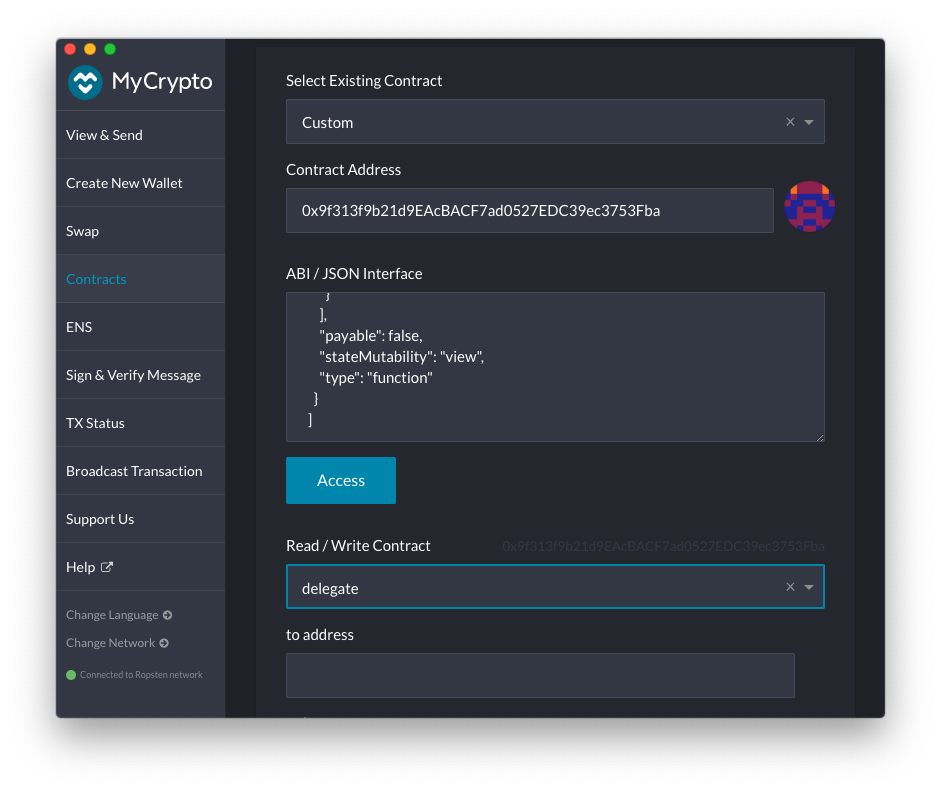
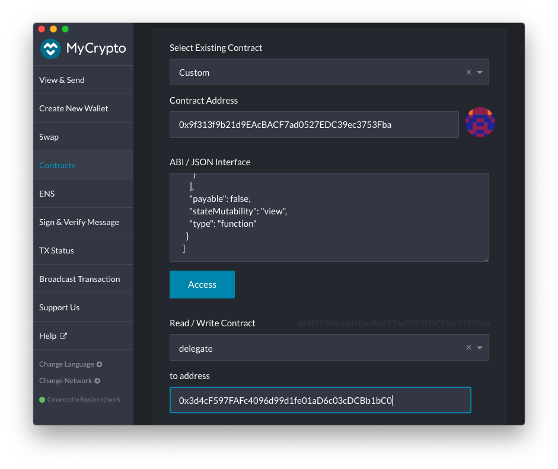
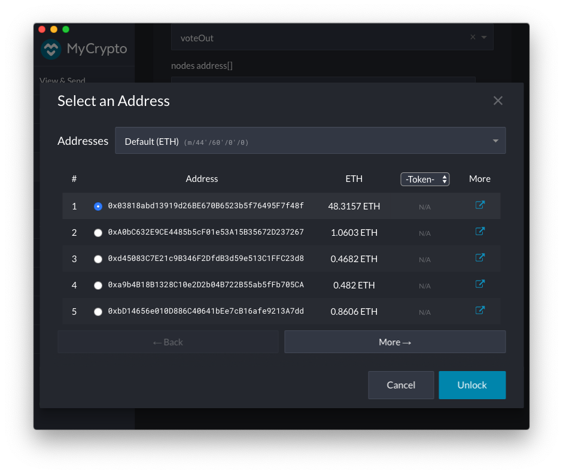
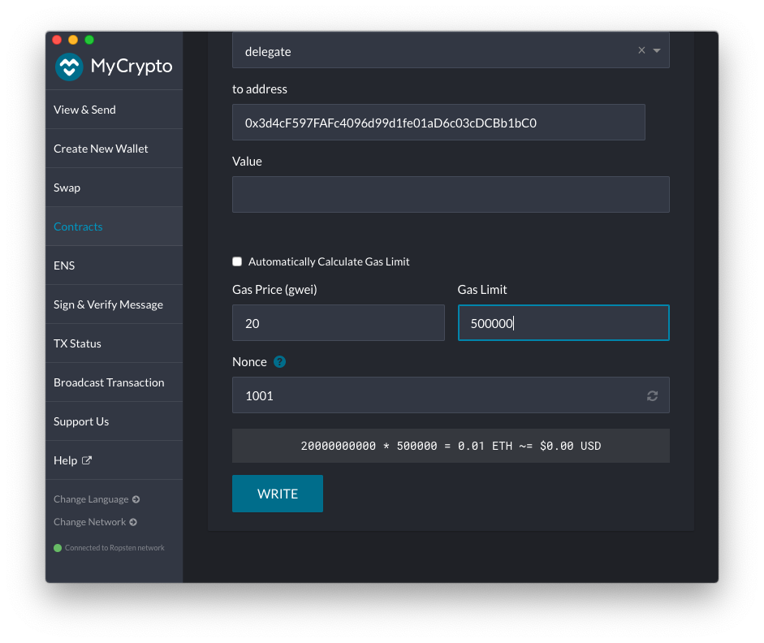
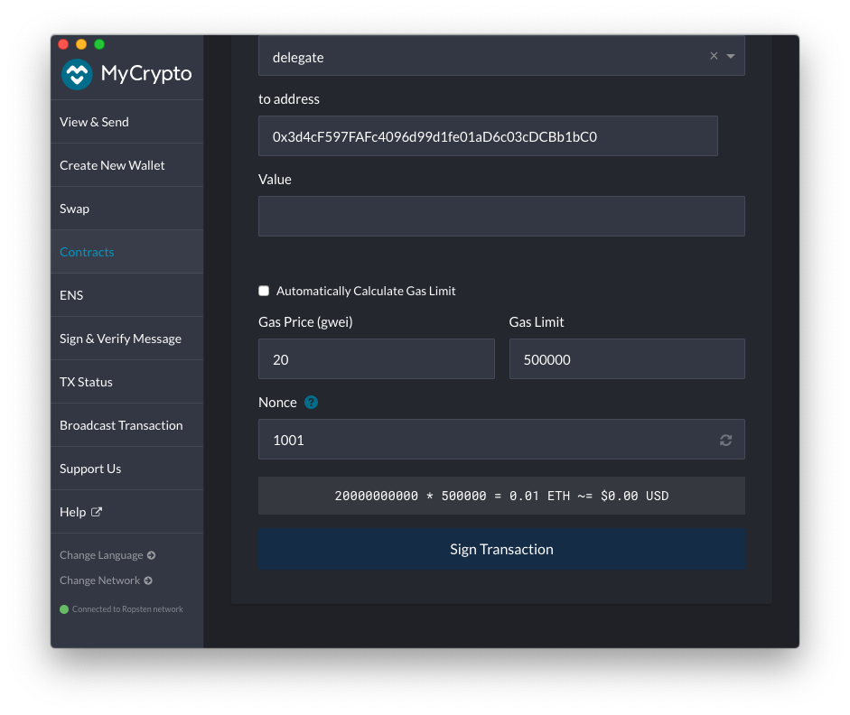
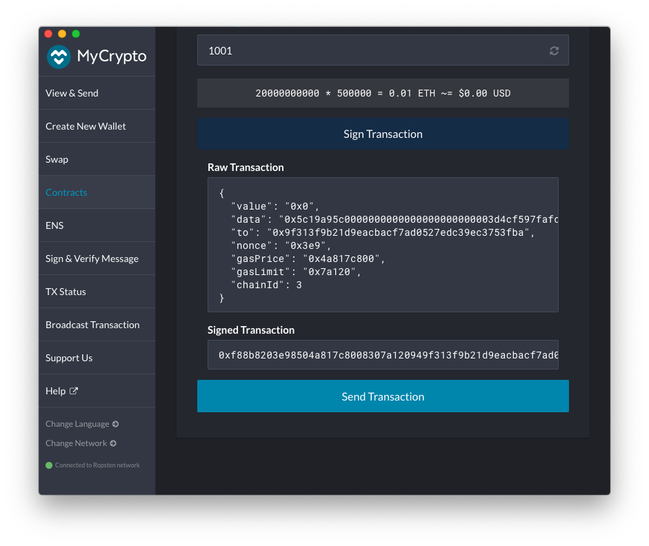
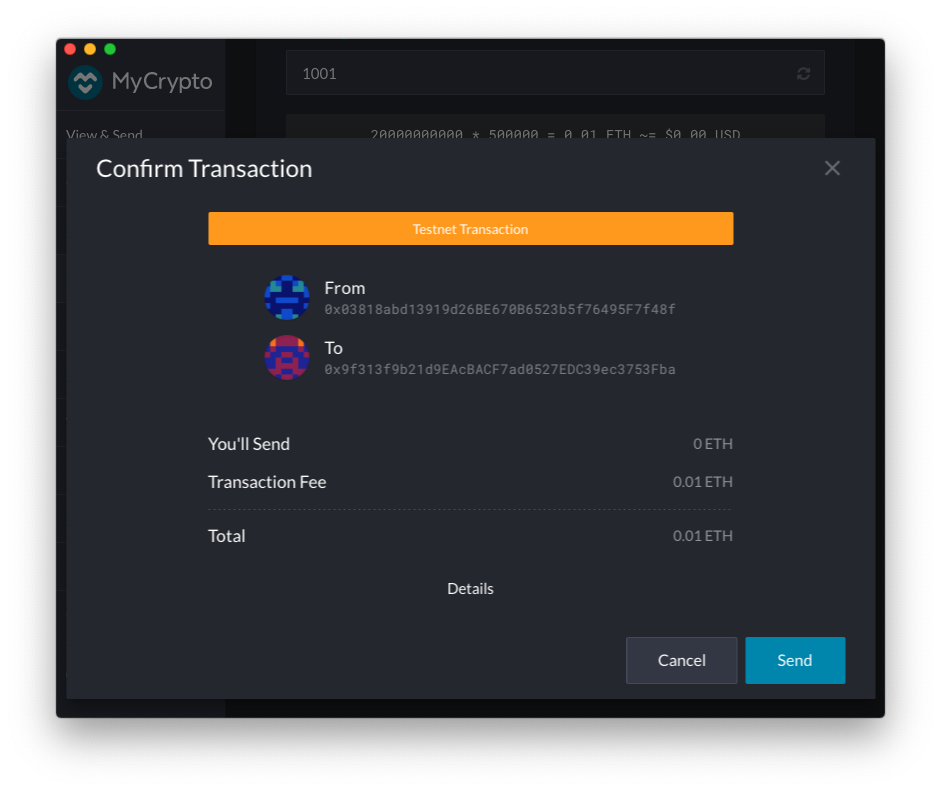
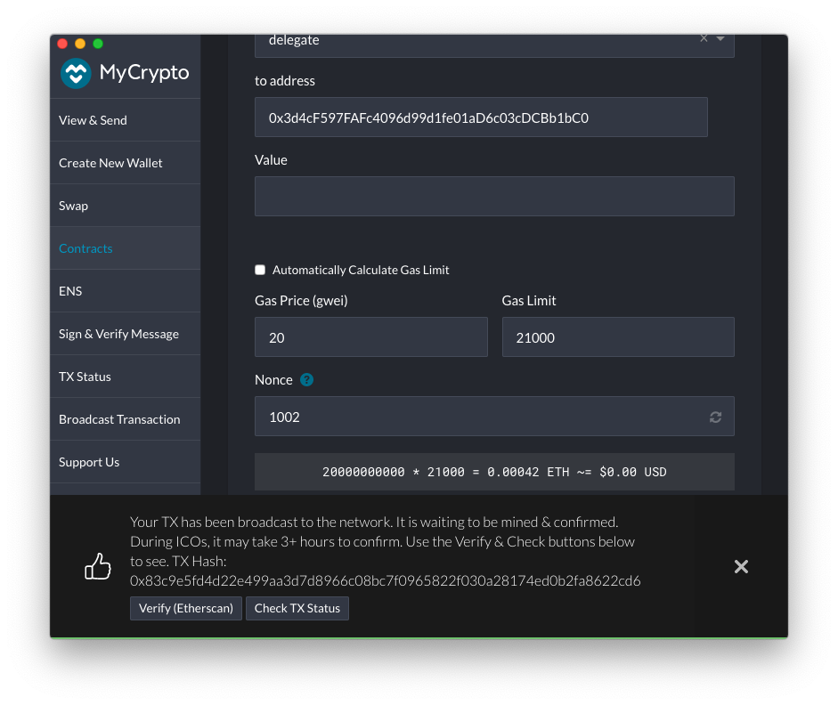

## Explicit/Implicit Delegation

Orbs token holders are encouraged to delegate their stake to another token holder 
or a guardian of their choice. By delegating to an active and reputable guardian
a delegator becomes eligible for rewards (see detailed explanation [here][voting_explained]).  

Delegation is performed by one of two mechanisms: 
* An *implicit delegation* is performed by a symbolic transfer of tokens
* An *explicit delegation* is performed by a transaction sent to OrbsVoting contract. 

Once delegated, the delegator's choice remains in place indefinitely, or until
another delegation occurs. However, and implicit delegation does not override an explicit delegation, even if
it occurs later than the explicit delegation.

To cancel all delegations, a later self-delegation may be performed. Delegating to one's self cancels any 
previous delegations. 

For a more detailed account of delegation (including implicit delegation), voting, and rewards see [here][voting_explained]

This document focuses on *Explicit delegations* using OrbsVoting contract.

The document walks you through the voting process using the MyCrypto desktop wallet application.
Any wallet software may be used, and the choice of MyCrypto here is for illustration only.

[voting_explained]: http://broken

### Delegation requires following data:
- Ethereum Address of another delegator or a *guardian* to delegate to

### Delegation pre-requirements
 - MyCrypto desktop app (or another equivalent wallet software)
 - A wallet setup with your Delegator's Ethereum account keys with a positive Ether balance for gas payment
 - ABI and contract address available on Etherscan. For example, on Ropsten testnet the contract may be found [here][1] 

### Delegation steps

In order to delegate follow these steps:

1. **Verify you are on the correct network** ([Choosing the relevant Ethereum Network](./choosing_the_network.md))
2. Navigate to *Contracts*, under the *Interact* tab.

1. Enter the `OrbsVoting` contract address. For Ropsten testnet the address may be found [here][1]. Paste the address in the text box labeled *Contract Address*.
1. Extract the Contract ABI from the Etherscan *code* [tab][1] and paste it in the test box labeled *ABI / JSON Interface*. 

1. Click *Access*.
   * If the *Access* button appears disabled, make sure there are no trailing line feeds at the bottom of the *ABI / JSON Interface* text box.
1. Select `delegate` in the drop down list *Read / Write Contract*

The function parameter for the `delegate` call will appear in the form.
1. Fill the parameter field labeled `to address`
with the Ethereum account address you would like to delegate to.
    - for example: `0x3d4cF597FAFc4096d99d1fe01aD6c03cDCBb1bC0`
    - only valid addresses are accepted. To cancel a previous delegation, delegate to the sender's address

1. Choose one of the options under *How would you like to access your wallet?*
and provide your wallet information/credentials.
In this example we choose to provide a mnemonic to open our wallet:

Click *Choose Address*

1. Select your Delegator's Ethereum address. 
The address you choose should be the address holding the Orbs token balance you wish to delegate.
Make sure the account has a positive Ether balance for transaction fees. 
 
Then click *Unlock* 

1. Uncheck *Automatically Calculate Gas Limit* and adjust the *Gas Limit* as required. 
`500,000` should be more than enough (at the time this is being written a successful delegation uses 
~64,352 Gas). You will not be charged for unused gas.
 
Click *WRITE*

Don't forget to adjust Gas Price so the transaction is accepted in a reasonable time. Then Click *Write*, and then *Sign Transaction* 

Click *Send Transaction*

Review, then click *Send*

1. Once the transaction is sent, MyCrypto will provide a link to track the transaction status on Etherscan.
Navigate to *Etherscan* by clicking *Verify (Etherscan)*

1. Confirm the transaction has been accepted successfully.

 
Make sure you see 
> TxReceipt Status:Success

With sufficient block confirmations.

[1]: https://ropsten.etherscan.io/address/0x9f313f9b21d9EAcBACF7ad0527EDC39ec3753Fba#code

##### Notes
* If a vote is made from a non-guardian address the vote will succeed but Orbs network will ignore it. Guardianship is verified on Orbs upon processing of voting results.
* If a vote is made with a non-validator address in the nodes list the vote will succeed but Orbs betwork will ignore the vote. Validator registration is verified on Orbs upon processing of voting result. 
* To change a vote just vote again before the end of the subscription period.
