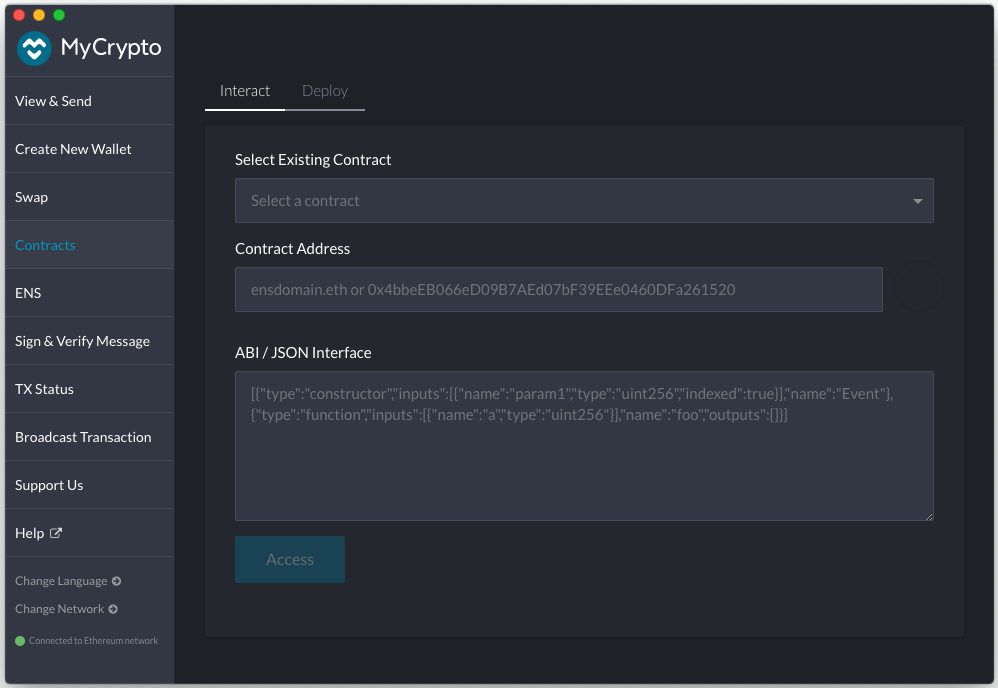
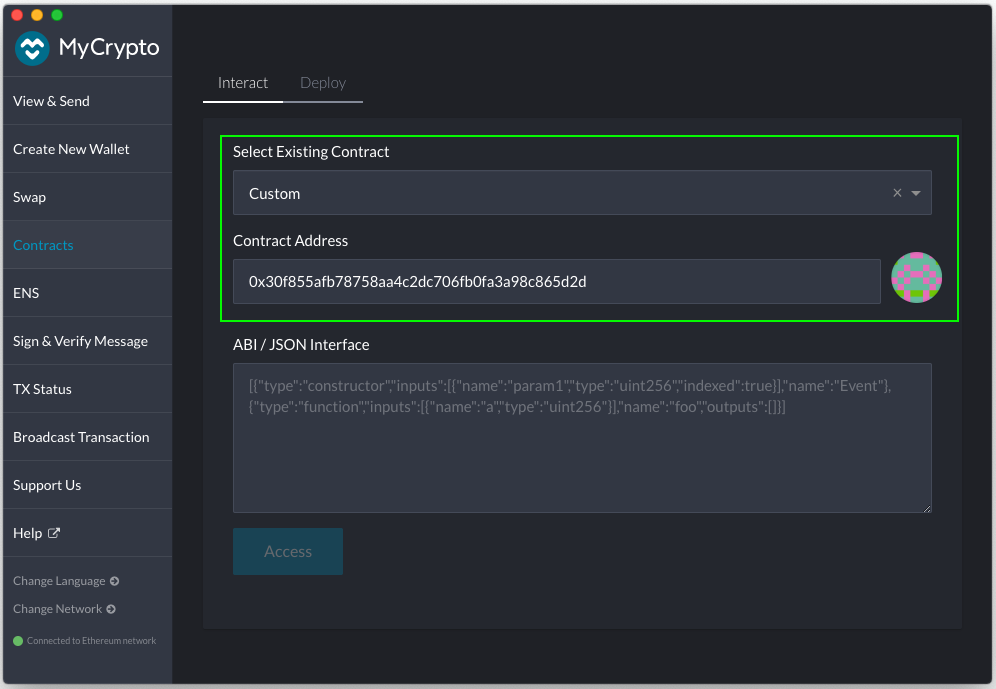
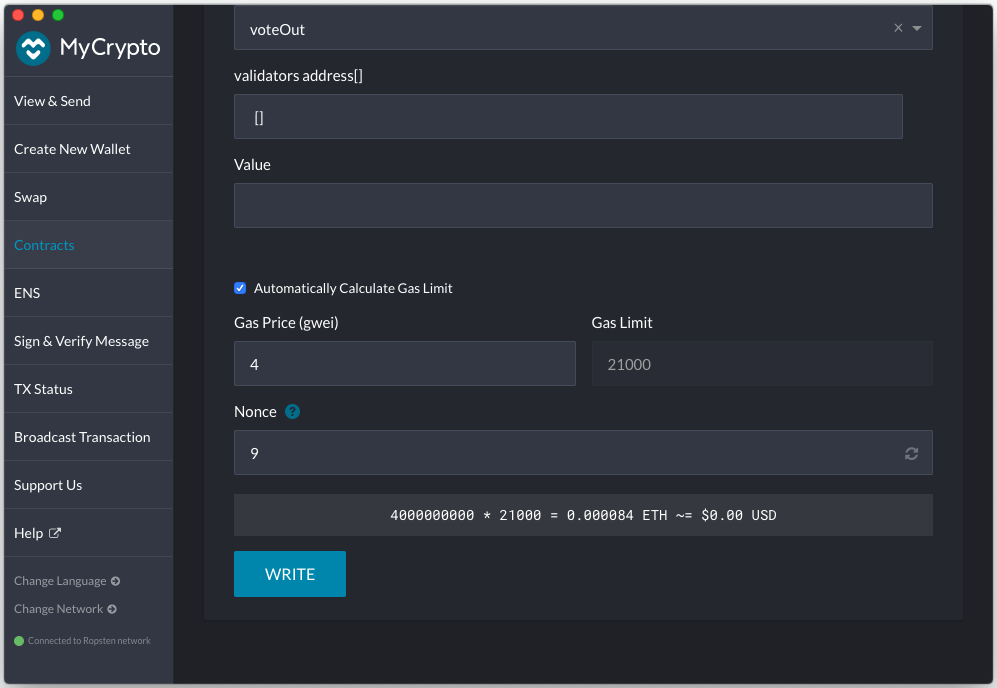

## Voting Out Validators

Guardians enforce the protocol by monitoring the network and __voting out__ Validators that do not properly participate in the protocol. A Guardian that identifies Validators that do not follow the protocol can vote them out. 
In each vote, a Guardian should vote in one of the following ways:
* __Vote an empty list__ (a.k.a. __"Keep Everyone"__) - this indicates that the Guardian is content with the entire set of listed Validators.
* __Vote out a list (between 1 and 3) of Validators__ - this indicates that the Guardian is not content with the performance of these Validators and would like to remove them from participating in the network. 

A Guardian may cast a vote at any time. This vote is valid for up to 45,500 Ethereum blocks (approximately one week). In order to participate in an election, a Guardian needs to have a valid vote at the time of the election event. When voting to vote out multiple Validators, the voting weight for each Validator equals to the Guardian’s total voting weight.

This document provides instructions for voting process using the MyCrypto desktop wallet application.
Any wallet software may be used, and the choice of MyCrypto here is for illustration only.

For voting using the voting UI see https://orbs-network.github.io/voting/guardian.

### Voting requires the following data:
- Ethereum addresses of up to three Orbs Validators to **vote out (=remove from the network)**

### Voting pre-requirements
 - MyCrypto desktop app (or another equivalent wallet software)
 - A wallet setup with your Guardians's Ethereum account keys with a positive Ether balance for gas payment.
 - Guardian registration with your Ethereum account. See: [Guardian registration](./guardian_registration.md)
 - ABI and contract address, available below in the Voting steps or on [Etherscan][1]

### Voting steps

In order to vote follow these steps:

1. **Verify you are on the correct network - Ethereum Mainnet** (See [Choosing the relevant Ethereum Network](./choosing_the_network.md))
1. Navigate to *Contracts*, under the *Interact* tab.

1. Select an existing custom contact and enter the `OrbsVoting` contract address. 
   
    **OrbsVoting Contract Address**: `0x30f855afb78758aa4c2dc706fb0fa3a98c865d2d`
  
    The contract address and ABI are also available on [Etherscan][1].

    Paste the address in the **Contract Address** box.

    

1. Enter the `OrbsVoting` contract ABI for voting.
   
   **`OrbsVoting` contract ABI for Voting:**

   [{"constant":false,"inputs":[{"name":"validators","type":"address[]"}],"name":"voteOut","outputs":[],"payable":false,"stateMutability":"nonpayable","type":"function"},{"constant":true,"inputs":[{"name":"guardian","type":"address"}],"name":"getCurrentVote","outputs":[{"name":"validators","type":"address[]"},{"name":"blockNumber","type":"uint256"}],"payable":false,"stateMutability":"view","type":"function"}]

    Alternatively, the ABI may be extracted directly from [Etherscan][1], **Contract ABI** box.
  
    Paste the ABI in the **ABI / JSON Interface** box.

    

1. Click *Access*.
   * If the *Access* button appears disabled, make sure there are no empty lines at the bottom of the *ABI / JSON Interface* text box.
1. Select `voteOut` in the drop down list *Read / Write Contract*

The function parameter for the `voteOut` call will appear in the form.
1. Fill the parameter field labeled `nodes address[]`
with the Ethereum addresses of the Validators that you wish to **vote out / remove from the network**
An empty list implies all validators are approved by the voting guardians.
    - The list will be represented as a JSON array. for example:
    - `"["0x1234567890123456789012345678901234567890", "0x0987654321098765432109876543210987654321"]"`
    - to represent an empty list enter `"[]"`
    - Addresses that do not match a registered Validator are ignored.

1. Choose one of the options under *How would you like to access your wallet?*
and provide your wallet information/credentials.
In this example we choose to work with a HW Ledger:

Proceed to *Choose Address*. 
1. Select your Guardians's Ethereum address. 
The address you choose should be your Guardian's address as registered in OrbsGuardians contract. See: [Guardian registration](./guardian_registration.md)

Make sure the account has a positive Ether balance for transaction fees.
  Then click *Unlock*. 

1.  Verify *Automatically Calculate Gas Limit* is checked and adjust Gas Price to a
reasonable value, for example according to https://ethgasstation.info/.

Click *Write*, then *Sign Transaction* 

Review, then click *Send*

1. Once the transaction is sent, MyCrypto will provide a link to track the transaction status on Etherscan.
Navigate to *Etherscan* by clicking *Verify (Etherscan)*

1. Confirm the transaction has been accepted successfully.

 
Make sure you see 
> TxReceipt Status:Success

With sufficient block confirmations.

1. Review your voting by calling getCurrentVote() with your Guardian address.

[1]: https://etherscan.io/address/0x30f855afb78758aa4c2dc706fb0fa3a98c865d2d#code

##### Notes
* If a vote is made from an address that is not registered as a Guardian the transaction will succeed, but the vote will be ignored by the Orbs network (Guardian registration is verified on Orbs during election processing)
* A transaction that votes out an address that isn't associated with an active Validator will succeed, but the vote will be ignored.
* A vote may be modified at any time. The last vote recorded before an election event is considered for the election.
