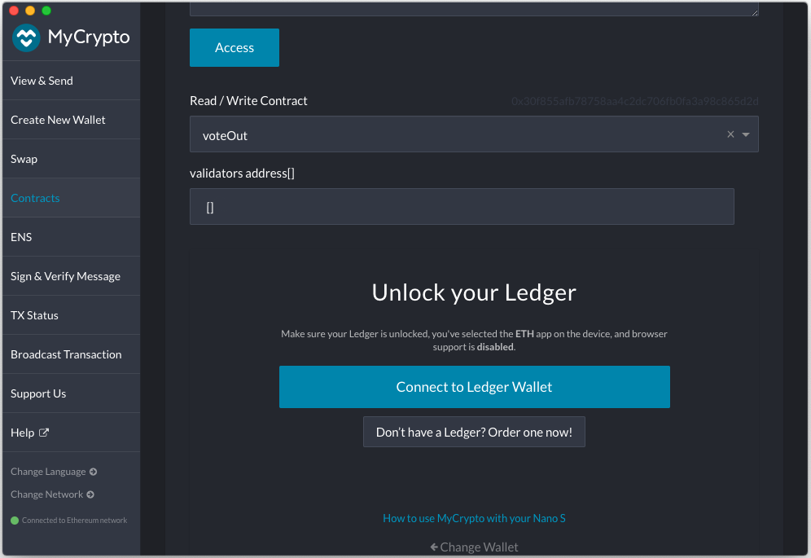
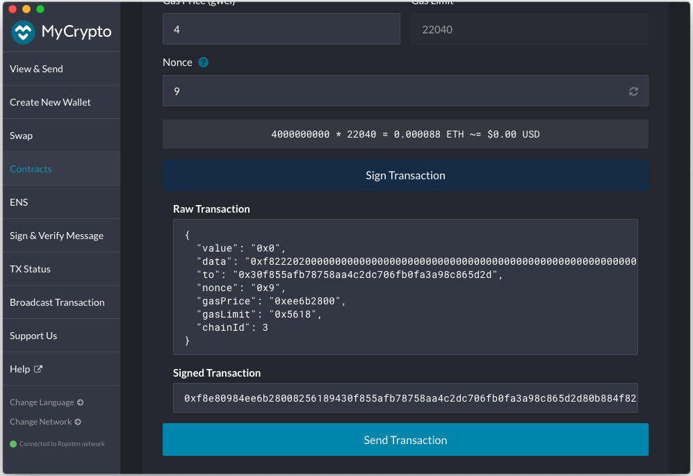

## Voting Out Validatots

Guardians enforce the protocol by monitoring the network by voting out Validatots that do not follow the protocol. A Guardian that identifies Validators that do not follow the protocol can vote them out. In each vote, a Guardian can vote out up to 3 Validators, a Guardian may by voting with an empty list, express consent to include all the listed Validators. 

A Guardian may cast a vote at any time which remains valid for up to 45,500 Ethereum blocks (approximately one week). In order to participate in an election, a guardian needs to have a valid vote at the time of the election event. When voting to vote out multiple Validators, the voting weight for each Validator equals to the Guardian’s total voting weight.

This document provides instructions for voting process using the MyCrypto desktop wallet application.
Any wallet software may be used, and the choice of MyCrypto here is for illustration only.

For voting using a voting UI see https://orbs-network.github.io/voting/guardian.

### Voting requires following data:
- Ethereum Addresses of up to three Orbs Validators to **vote out**

### Voting pre-requirements
 - MyCrypto desktop app (or another equivalent wallet software)
 - A wallet setup with your Guardians's Ethereum account keys with a positive Ether balance for gas payment.
 - Guardian registration of with your Ethereum account. See: [Guardian registration](./guardian_registration.md)
 - ABI and contract address, available below in the Registration steps or on [Etherscan][1]

### Voting steps

In order to vote follow these steps:

1. **Verify you are on the correct network - Ethereum Mainnet** (See [Choosing the relevant Ethereum Network](./choosing_the_network.md))
1. Navigate to *Contracts*, under the *Interact* tab.

1. Select an existing custom contact and enter the `OrbsVoting` contract address. 
   
    **OrbsVoting Contract Address**: `0x30f855afb78758aa4c2dc706fb0fa3a98c865d2d`
  
    The contract address and ABI are also available on [Etherscan][1].

    Paste the address in the **Contract Address** box.

    

1. Enter the `OrbsVoting` contract ABI for voting.
   
   **`OrbsVoting` contract ABI for Voting:**

   [{"constant":false,"inputs":[{"name":"validators","type":"address[]"}],"name":"voteOut","outputs":[],"payable":false,"stateMutability":"nonpayable","type":"function"},{"constant":true,"inputs":[{"name":"guardian","type":"address"}],"name":"getCurrentVote","outputs":[{"name":"validators","type":"address[]"},{"name":"blockNumber","type":"uint256"}],"payable":false,"stateMutability":"view","type":"function"}]

    Alternatively, the ABI may be extracted directly from [Etherscan][1], **Contract ABI** box.
  
    Paste the ABI in the **ABI / JSON Interface** box.

    

1. Click *Access*.
   * If the *Access* button appears disabled, make sure there are no empty lines at the bottom of the *ABI / JSON Interface* text box.
1. Select `voteOut` in the drop down list *Read / Write Contract*

The function parameter for the `voteOut` call will appear in the form.
1. Fill the parameter field labeled `nodes address[]`
with the Ethereum addresses of the Validators you wish to vote out.
An empty list implies all validators are approved by the voting guardians.
    - The list will be represented as a JSON array. for example:
    - `"["0x1234567890123456789012345678901234567890", "0x0987654321098765432109876543210987654321"]"`
    - to represent an empty list enter `"[]"`
    - Addresses that do not match a registered Validator are ignored.

1. Choose one of the options under *How would you like to access your wallet?*
and provide your wallet information/credentials.
In this example we choose to work with a HW Ledger:

Proceed to *Choose Address*. 
1. Select your Guardians's Ethereum address. 
The address you choose should be your Guardian's address as registered in OrbsGuardians contract. See: [Guardian registration](./guardian_registration.md)

Make sure the account has a positive Ether balance for transaction fees.
  Then click *Unlock*. 

1.  Verify *Automatically Calculate Gas Limit* is checked and adjust Gas Price to a
reasonable value, for example according to https://ethgasstation.info/.

Click *Write*, then *Sign Transaction* 

Review, then click *Send*

1. Once the transaction is sent, MyCrypto will provide a link to track the transaction status on Etherscan.
Navigate to *Etherscan* by clicking *Verify (Etherscan)*

1. Confirm the transaction has been accepted successfully.

 
Make sure you see 
> TxReceipt Status:Success

With sufficient block confirmations.

1. Review your voting by calling getCurrentVote() with your Guardian address.

[1]: https://etherscan.io/address/0x30f855afb78758aa4c2dc706fb0fa3a98c865d2d#code

##### Notes
* If a vote is made from an address not registered as a Guardian the transaction will succeed but the vote will be ignored by Orbs network. Registration is verified on Orbs upon processing of voting results.
* A transaction that Votes out address of non-Validators will succeed but the vote will be ignored.
* A vote may be modified at any time. The last vote recorded before an election event is taken into consideration for the election.
