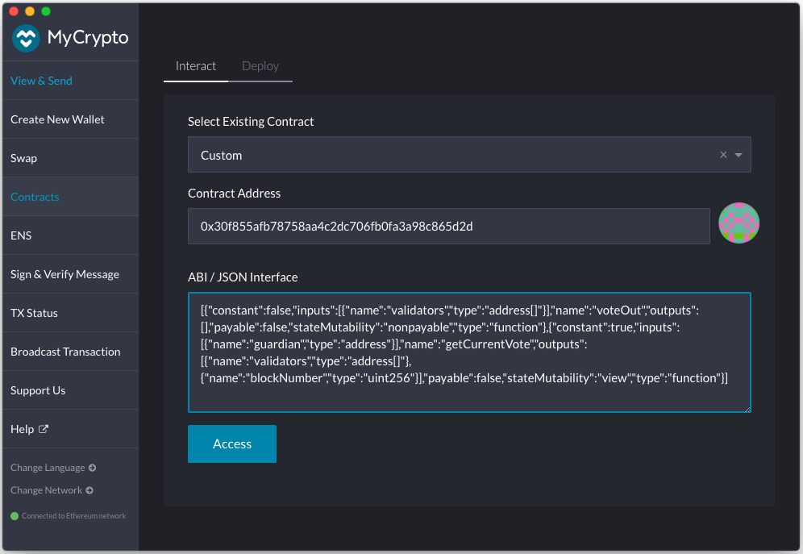
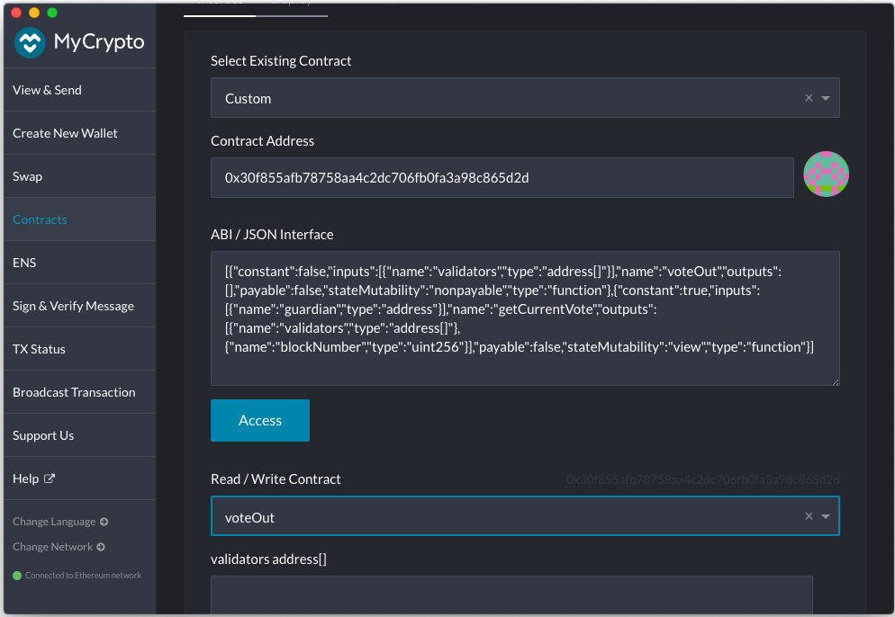
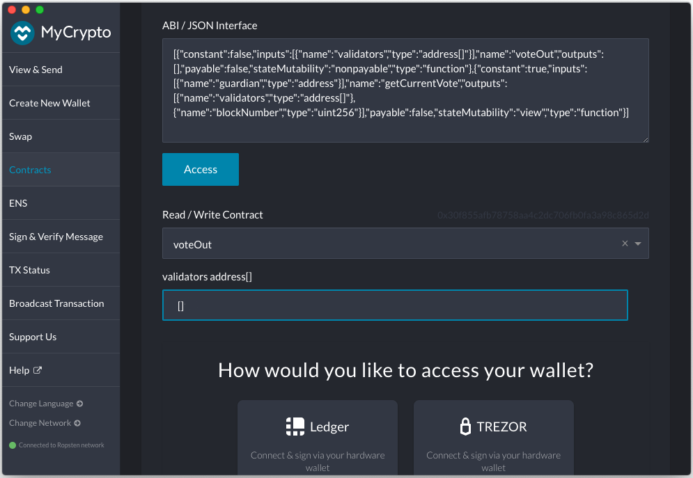
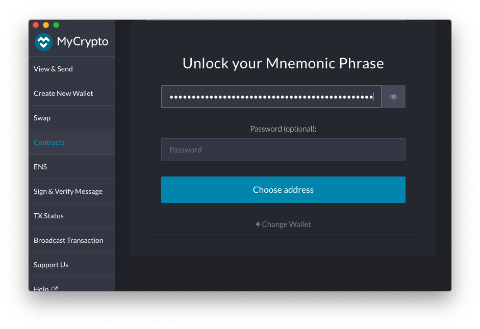
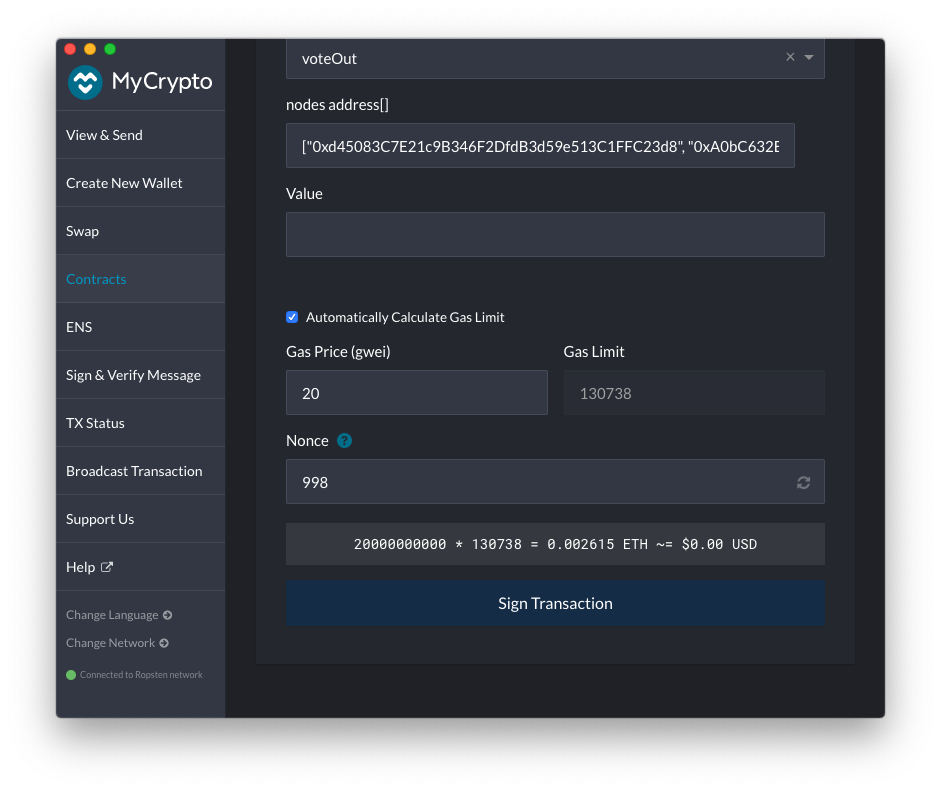
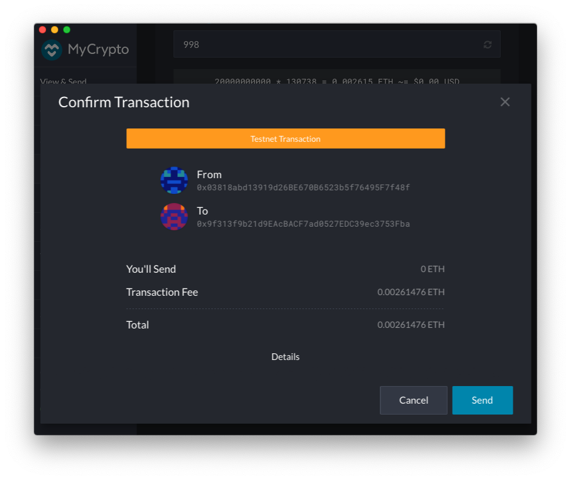
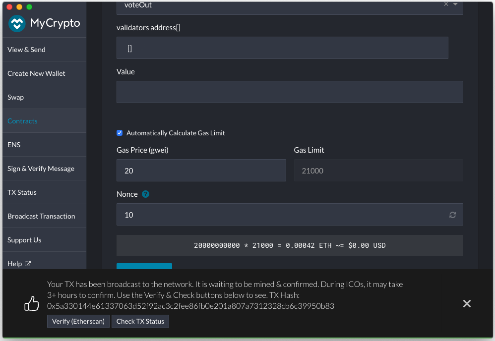
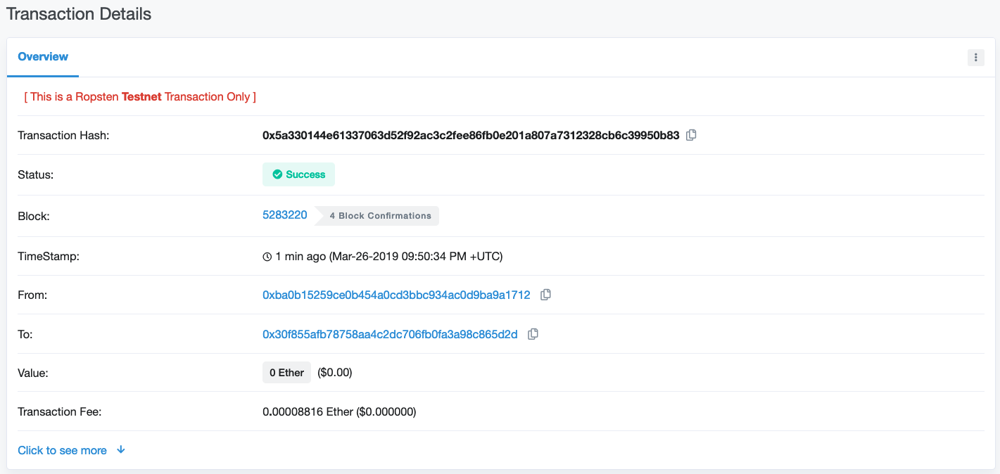

## Voting

During each election period, Guardians vote to approve or remove validators from the active Orbs committee.
Gaurdians may vote several times in each election period, the latest vote transaction in each election period is the one that counts.

Voting is performed via a transaction sent to OrbsVoting contract. The transaction includes
a list of validators deemed unwanted as Orbs block signers. By sending an empty list, the 
Guardian expresses consent to include all listed validators in the signing committee.

For a more detailed account of delegation, voting, and rewards see [here](???)

This document walks you through the voting process using the MyCrypto desktop wallet application.
Any wallet software may be used, and the choice of MyCrypto here is for illustration only.

### Voting requires following data:
- Ethereum Addresses of up to three Orbs Validators to vote for removal from active committee

### Voting pre-requirements
 - MyCrypto desktop app (or another equivalent wallet software)
 - A wallet setup with your Guardians's Ethereum account keys with a positive Ether balance for gas payment
 - ABI and contract address available on Etherscan. For example, on Ropsten testnet the contract may be found [here][1] 

### Voting steps

In order to vote follow these steps:

1. **Verify you are on the correct network** ([Choosing the relevant Ethereum Network](./choosing_the_network.md))
2. Navigate to *Contracts*, under the *Interact* tab.

1. Enter the `OrbsVoting` contract address. For Ropsten testnet the address may be found [here][1]. Paste the address in the text box labeled *Contract Address*.
1. Extract the Contract ABI from the Etherscan *code* [tab][1] and paste it in the test box labeled *ABI / JSON Interface*. 

1. Click *Access*.
   * If the *Access* button appears disabled, make sure there are no trailing line feeds at the bottom of the *ABI / JSON Interface* text box.
1. Select `voteOut` in the drop down list *Read / Write Contract*

The function parameter for the `voteOut` call will appear in the form.
1. Fill the parameter field labeled `nodes address[]`
with the Ethereum addresses corresponding to any Validator you wish to vote out.
An empty list implies all validators are approved by the voting guardians.
    - The list will be represented as a JSON array. for example:
    - `["0xd45083C7E21c9B346F2DfdB3d59e513C1FFC23d8", "0xA0bC632E9CE4485b5cF01e53A15B35672D237267"]`
    - to represent an empty list pass `[]`
    - If any of the addresses does not match a registered validator it will be ignored by Orbs when counting votes
    - validators are indicated using their Ethereum accounts addresses as registered under the OrbsValidatorsRegistry contract.

1. Choose one of the options under *How would you like to access your wallet?*
and provide your wallet information/credentials.
In this example we choose to provide a mnemonic to open our wallet:

Click *Choose Address*

1. Select your Guardians's Ethereum address. 
The address you choose should be your Guardian's identifying address as [registered under OrbsGuardians](./guardian_registration.md) contract.
Make sure the account has a positive Ether balance for transaction fees.
  Then click *Unlock*. 

1. Verify *Automatically Calculate Gas Limit* is checked. 

Don't forget to adjust Gas Price so the transaction is accepted in a reasonable time. Then Click *Write*, and then *Sign Transaction* 

Click *Send Transaction*

Review, then click *Send*

1. Once the transaction is sent, MyCrypto will provide a link to track the transaction status on Etherscan.
Navigate to *Etherscan* by clicking *Verify (Etherscan)*

1. Confirm the transaction has been accepted successfully.

 
Make sure you see 
> TxReceipt Status:Success

With sufficient block confirmations.

[1]: https://ropsten.etherscan.io/address/0x9f313f9b21d9EAcBACF7ad0527EDC39ec3753Fba#code

##### Notes
* If a vote is made from a non-guardian address the vote will succeed but Orbs network will ignore it. Guardianship is verified on Orbs upon processing of voting results.
* If a vote is made with a non-validator address in the nodes list the vote will succeed but Orbs betwork will ignore the vote. Validator registration is verified on Orbs upon processing of voting result. 
* A vote may be modified at any time, where the last vote recorded before an election event is taken into consideration.
